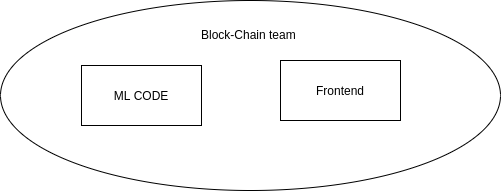
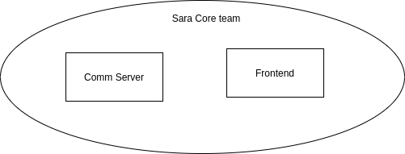

# Containerized Development
The AIM is to have development in container(i.e Docker conatiner),this will resolve following challenges:
#### 1. Developer having access to all the repositry even if there are notworking on it.
   At present all the developer have access to all the repositry, irrespective of whether they are working on it or not. This is so that they can have integrted version in there machine to test End-to-End.
#### 2. Conflicting Dependencies
   At release we have this conflict of dependencies, having issues beacuse of change in production and development package versions.
#### 3. Integration challenges
   At times we have challenge in setting up integrated version in developer machine. This is because multiple teams are continiously working on new things.

# Proposed solution:
To do development in container's, as this will resolve above mentioned challenges.

# Overview of how to implement
   Setup CICD for every project and generate updated image with obfuscated code for use of other teams. Things to be noted is that the runner should be configured in one of the internal server and we need to maintain one internal registry for development images.
   
# Containers for respective will look like this:
####   Container for Block-chain team

   

####   Container for Sara-core team
   

####   Container for Frontend team
   